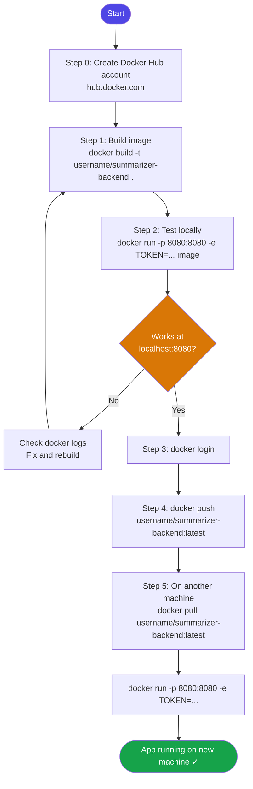

# Assignment Steps: Docker Hub — Package, Push & Pull

> **BITS Pilani M.Tech — Introduction to DevOps, Semester 2, Assignment 1**
>
> *"Take the logic of NSP-4-S2-S25App and package it as a Docker Image. Push this image to Docker Hub and pull it to run on a local machine."*

---

## Prerequisites

- [Docker Desktop](https://www.docker.com/products/docker-desktop) installed and running
- A [Docker Hub](https://hub.docker.com) account (free)
- A Hugging Face API token with **"Make calls to Inference Providers"** permission

---

## Complete Flow



---

## Step 0 — Create a Docker Hub account

1. Go to [https://hub.docker.com](https://hub.docker.com) and sign up (free)
2. Note your **Docker Hub username** (e.g. `johndoe`) — you'll use it in every command below
3. Keep the browser tab open for Step 3

---

## Step 1 — Build the Docker image

```bash
# Navigate into the backend folder (contains the Dockerfile)
cd summarizer-backend

# Build the image and tag it with your Docker Hub username
docker build -t YOUR_DOCKERHUB_USERNAME/summarizer-backend:latest .
```

> The multi-stage Dockerfile will:
> 1. Pull `eclipse-temurin:25-jdk`, compile the Java source **inside Docker** — no local Java needed
> 2. Copy only the JAR into a slim `eclipse-temurin:25-jre` runtime image

Verify the image was created:
```bash
docker images | grep summarizer-backend
```

Expected output:
```
YOUR_DOCKERHUB_USERNAME/summarizer-backend   latest   abc123def456   1 minute ago   ~350MB
```

---

## Step 2 — Test the image locally before pushing

```bash
# Windows PowerShell
docker run --rm -p 8080:8080 -e HUGGINGFACE_TOKEN=hf_YOUR_TOKEN_HERE `
  YOUR_DOCKERHUB_USERNAME/summarizer-backend:latest

# Linux / Mac
docker run --rm -p 8080:8080 -e HUGGINGFACE_TOKEN=hf_YOUR_TOKEN_HERE \
  YOUR_DOCKERHUB_USERNAME/summarizer-backend:latest
```

Open **http://localhost:8080**, paste some text, and click **Summarize**. Stop with `Ctrl+C`.

---

## Step 3 — Log in to Docker Hub

```bash
docker login
# Enter your Docker Hub username and password when prompted
```

Expected output:
```
Login Succeeded
```

---

## Step 4 — Push the image to Docker Hub

```bash
docker push YOUR_DOCKERHUB_USERNAME/summarizer-backend:latest
```

Expected output:
```
The push refers to repository [docker.io/YOUR_DOCKERHUB_USERNAME/summarizer-backend]
layer1: Pushed
layer2: Pushed
...
latest: digest: sha256:abc123... size: 1234
```

Verify it is visible on Docker Hub:
```
https://hub.docker.com/r/YOUR_DOCKERHUB_USERNAME/summarizer-backend
```

---

## Step 5 — Pull and run on another machine

On **any other machine** that has Docker installed (no Java, no source code needed):

```bash
# Pull the image from Docker Hub
docker pull YOUR_DOCKERHUB_USERNAME/summarizer-backend:latest

# Run it
docker run -p 8080:8080 -e HUGGINGFACE_TOKEN=hf_YOUR_TOKEN_HERE \
  YOUR_DOCKERHUB_USERNAME/summarizer-backend:latest
```

Open **http://localhost:8080** — the full app is running with no local build or Java install.

---

## Quick Reference — All Docker Commands

```bash
# Build (from summarizer-backend/ folder)
docker build -t USERNAME/summarizer-backend:latest .

# Run locally with token
docker run --rm -p 8080:8080 -e HUGGINGFACE_TOKEN=hf_xxx USERNAME/summarizer-backend:latest

# Login to Docker Hub
docker login

# Push
docker push USERNAME/summarizer-backend:latest

# Pull (on any machine)
docker pull USERNAME/summarizer-backend:latest

# Run after pull
docker run -p 8080:8080 -e HUGGINGFACE_TOKEN=hf_xxx USERNAME/summarizer-backend:latest

# Stop a running container
docker ps                    # find CONTAINER_ID
docker stop CONTAINER_ID

# View logs
docker logs CONTAINER_ID
```

---

## Troubleshooting

| Error | Cause | Fix |
|---|---|---|
| `permission denied` on push | Not logged in | Run `docker login` first |
| `ERROR: Invalid token` in app | Wrong HF token | Check token at https://huggingface.co/settings/tokens |
| `port already in use` | Port 8080 taken | Use `-p 9090:8080` and open http://localhost:9090 |
| `image not found` on pull | Wrong username/image name | Check exact name on hub.docker.com |
| Container exits immediately | Build failed | Run `docker logs CONTAINER_ID` to see error |
