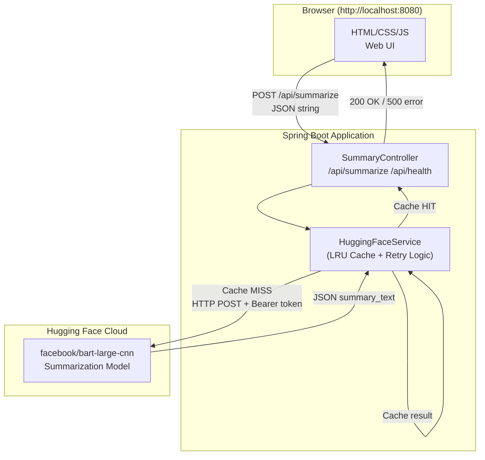
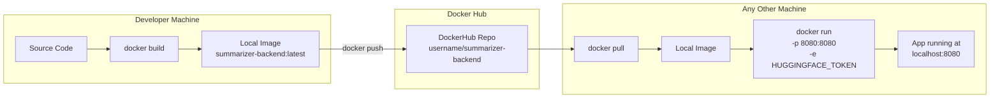
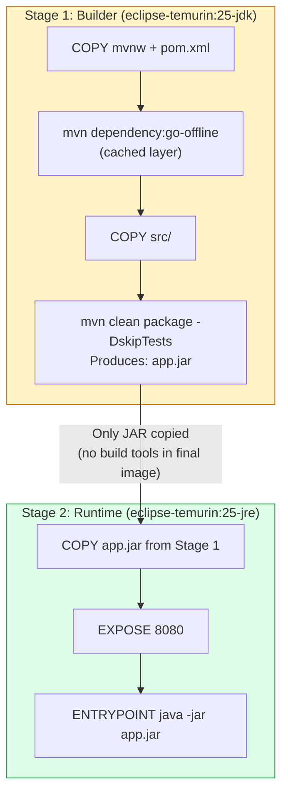
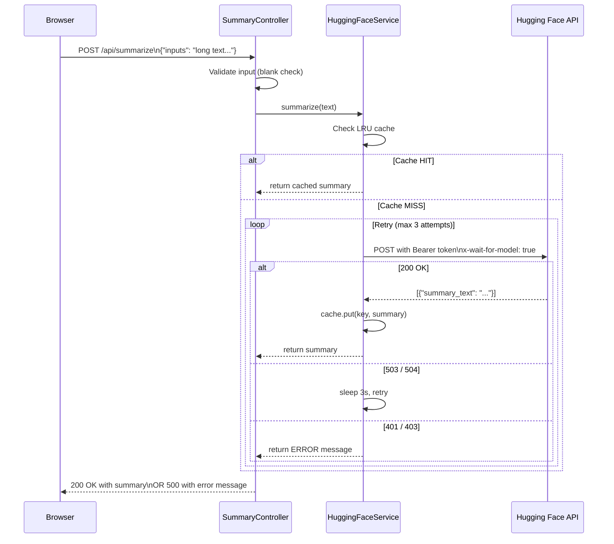

# AI Text Summarizer

A full-stack AI-powered text summarization application built with **Spring Boot** and a vanilla JS web UI. Deployed via **Docker** for portability across machines.

> **BITS Pilani M.Tech — Introduction to DevOps, Semester 2, Assignment 1**

---

## Architecture Overview



---

## Docker Deployment Flow



---

## Multi-Stage Docker Build



---

## Request Lifecycle



---

## Tech Stack

| Layer | Technology |
|---|---|
| Backend Framework | Spring Boot 4.0.6 |
| Language | Java 25 |
| Build Tool | Maven 3.9 (wrapper included) |
| AI Model | Hugging Face — `facebook/bart-large-cnn` |
| HTTP Client | `java.net.HttpURLConnection` |
| Frontend | Vanilla HTML/CSS/JS (served as static resource) |
| Containerization | Docker (multi-stage build) + Docker Compose |
| Secrets Management | `secrets.properties` (gitignored) / env var |

---

## Project Structure

```
Assignment-1/
├── start.ps1                          # One-click runner (Windows)
├── start.sh                           # One-click runner (Linux / Mac)
├── summarizer-backend/
│   ├── Dockerfile                     # Multi-stage Docker build
│   ├── docker-compose.yml             # Compose file for easy Docker run
│   ├── .dockerignore
│   ├── pom.xml
│   ├── mvnw / mvnw.cmd                # Maven wrapper (no Maven install needed)
│   └── src/main/
│       ├── java/com/example/summarizerbackend/
│       │   ├── SummarizerBackendApplication.java
│       │   ├── controller/SummaryController.java   # REST endpoints
│       │   └── service/HuggingFaceService.java     # AI API + cache + retry
│       └── resources/
│           ├── application.properties
│           ├── secrets.properties          # ← YOU CREATE THIS (gitignored)
│           ├── secrets.properties.example  # Template
│           └── static/index.html           # Embedded web UI
```

---

## Prerequisites

### For local (Java) mode
- **JDK 25+** — [Download](https://adoptium.net/)
- A **Hugging Face account** with an API token — [Get token](https://huggingface.co/settings/tokens)
  - Token must have **"Make calls to Inference Providers"** permission enabled

### For Docker mode
- **Docker Desktop** — [Download](https://www.docker.com/products/docker-desktop)
- A Hugging Face API token (same as above)
- **No Java install required** — Docker builds everything inside the container

---

## Quick Start

### Option 1 — Single Script (Recommended)

**Windows (PowerShell):**
```powershell
# Local Java run
.\start.ps1 -Token hf_YOUR_TOKEN_HERE

# Docker run (builds image automatically)
.\start.ps1 -Docker -Token hf_YOUR_TOKEN_HERE

# Docker run with force rebuild
.\start.ps1 -DockerBuild -Token hf_YOUR_TOKEN_HERE
```

**Linux / Mac:**
```bash
chmod +x start.sh

# Local Java run
./start.sh --token hf_YOUR_TOKEN_HERE

# Docker run
./start.sh docker --token hf_YOUR_TOKEN_HERE

# Docker run with force rebuild
./start.sh docker-build --token hf_YOUR_TOKEN_HERE
```

Open your browser at: **http://localhost:8080**

---

### Option 2 — Manual (Local Java)

```bash
cd summarizer-backend

# 1. Create the secrets file
echo "huggingface.token=hf_YOUR_TOKEN_HERE" > src/main/resources/secrets.properties

# 2. Build
./mvnw clean package -DskipTests       # Linux/Mac
.\mvnw.cmd clean package -DskipTests   # Windows

# 3. Run
java -jar target/summarizer-backend-0.0.1-SNAPSHOT.jar
```

---

### Option 3 — Docker Compose

```bash
cd summarizer-backend

export HUGGINGFACE_TOKEN=hf_YOUR_TOKEN_HERE   # Linux/Mac
$env:HUGGINGFACE_TOKEN="hf_YOUR_TOKEN_HERE"   # Windows PowerShell

docker compose up --build
```

---

## Assignment: Docker Hub

> Full step-by-step guide for the assignment requirement (build → push → pull):
> **[ASSIGNMENT_DOCKER_HUB.md](ASSIGNMENT_DOCKER_HUB.md)**

---

## API Endpoints

| Method | Path | Description |
|---|---|---|
| `POST` | `/api/summarize` | Summarize text. Body: plain JSON string |
| `GET` | `/api/health` | Health check — returns `OK` |

**Example:**
```bash
curl -X POST http://localhost:8080/api/summarize \
  -H "Content-Type: application/json" \
  -d '"Your long text to summarize goes here..."'
```

---

## Configuration

### Token (required for summarization)

| Method | How |
|---|---|
| Local dev | Create `summarizer-backend/src/main/resources/secrets.properties` with `huggingface.token=hf_xxx` |
| Docker / CI | Set environment variable `HUGGINGFACE_TOKEN=hf_xxx` |

> `secrets.properties` is **gitignored** and will never be committed. Use `secrets.properties.example` as a template.

### Key application settings

| Setting | Value | Location |
|---|---|---|
| Server port | `8080` | Spring Boot default |
| AI model | `facebook/bart-large-cnn` | `HuggingFaceService.java` |
| Max retries | `3` | `HuggingFaceService.java` |
| Retry delay | `3000 ms` | `HuggingFaceService.java` |
| Response cache | LRU, 50 entries | `HuggingFaceService.java` |
| Client timeout | `30s connect / 120s read` | `HuggingFaceService.java` |

---

## Web UI Features

- Dark / light theme toggle
- Live word and character counter
- Ctrl+Enter shortcut to submit
- Paste and clear buttons
- Copy-to-clipboard on result
- Stats bar: words in/out, % reduction, response time
- History panel: last 10 summaries (stored in `localStorage`)

---

## How it Works

```
Browser → POST /api/summarize
       → SummaryController (validates input)
       → HuggingFaceService (check LRU cache)
       → [cache miss] → router.huggingface.co (facebook/bart-large-cnn)
       → parse JSON response
       → cache result + return summary
       → Browser displays summary + stats
```

---

## Docker Image Details

The `Dockerfile` uses a **multi-stage build**:

1. **Stage 1 (`builder`)** — `eclipse-temurin:25-jdk`: Downloads dependencies, compiles source, produces the JAR
2. **Stage 2 (runtime)** — `eclipse-temurin:25-jre`: Copies only the JAR — results in a smaller, secure final image

This means **no Java installation is needed on the host machine** — Docker handles the full build and run lifecycle.


| Layer | Technology |
|---|---|
| Backend Framework | Spring Boot 4.0.6 |
| Language | Java 25 |
| Build Tool | Maven 3.9 (wrapper included) |
| AI Model | Hugging Face — `facebook/bart-large-cnn` |
| HTTP Client | `java.net.HttpURLConnection` |
| Frontend | Vanilla HTML/CSS/JS (served as static resource) |
| Containerization | Docker (multi-stage build) + Docker Compose |
| Secrets Management | `secrets.properties` (gitignored) / env var |

---

## Project Structure

```
Assignment-1/
├── start.ps1                          # One-click runner (Windows)
├── start.sh                           # One-click runner (Linux / Mac)
├── summarizer-backend/
│   ├── Dockerfile                     # Multi-stage Docker build
│   ├── docker-compose.yml             # Compose file for easy Docker run
│   ├── .dockerignore
│   ├── pom.xml
│   ├── mvnw / mvnw.cmd                # Maven wrapper (no Maven install needed)
│   └── src/main/
│       ├── java/com/example/summarizerbackend/
│       │   ├── SummarizerBackendApplication.java
│       │   ├── controller/SummaryController.java   # REST endpoints
│       │   └── service/HuggingFaceService.java     # AI API + cache + retry
│       └── resources/
│           ├── application.properties
│           ├── secrets.properties          # ← YOU CREATE THIS (gitignored)
│           ├── secrets.properties.example  # Template
│           └── static/index.html           # Embedded web UI
```

---

## Prerequisites

### For local (Java) mode
- **JDK 25+** — [Download](https://adoptium.net/)
- A **Hugging Face account** with an API token — [Get token](https://huggingface.co/settings/tokens)
  - Token must have **"Make calls to Inference Providers"** permission enabled

### For Docker mode
- **Docker Desktop** — [Download](https://www.docker.com/products/docker-desktop)
- A Hugging Face API token (same as above)
- **No Java install required** — Docker builds everything inside the container

---

## Quick Start

### Option 1 — Single Script (Recommended)

**Windows (PowerShell):**
```powershell
# Local Java run
.\start.ps1 -Token hf_YOUR_TOKEN_HERE

# Docker run (builds image automatically)
.\start.ps1 -Docker -Token hf_YOUR_TOKEN_HERE

# Docker run with force rebuild
.\start.ps1 -DockerBuild -Token hf_YOUR_TOKEN_HERE
```

**Linux / Mac:**
```bash
chmod +x start.sh

# Local Java run
./start.sh --token hf_YOUR_TOKEN_HERE

# Docker run
./start.sh docker --token hf_YOUR_TOKEN_HERE

# Docker run with force rebuild
./start.sh docker-build --token hf_YOUR_TOKEN_HERE
```

Open your browser at: **http://localhost:8080**

---

### Option 2 — Manual (Local Java)

```bash
cd summarizer-backend

# 1. Create the secrets file
echo "huggingface.token=hf_YOUR_TOKEN_HERE" > src/main/resources/secrets.properties

# 2. Build
./mvnw clean package -DskipTests       # Linux/Mac
.\mvnw.cmd clean package -DskipTests   # Windows

# 3. Run
java -jar target/summarizer-backend-0.0.1-SNAPSHOT.jar
```

---

### Option 3 — Docker

```bash
cd summarizer-backend

# Build image
docker build -t summarizer-backend .

# Run container (token passed as env var)
docker run -p 8080:8080 -e HUGGINGFACE_TOKEN=hf_YOUR_TOKEN_HERE summarizer-backend

# OR push to Docker Hub and pull on another machine
docker tag summarizer-backend YOUR_DOCKERHUB_USERNAME/summarizer-backend:latest
docker push YOUR_DOCKERHUB_USERNAME/summarizer-backend:latest

# On any other machine:
docker pull YOUR_DOCKERHUB_USERNAME/summarizer-backend:latest
docker run -p 8080:8080 -e HUGGINGFACE_TOKEN=hf_YOUR_TOKEN_HERE YOUR_DOCKERHUB_USERNAME/summarizer-backend:latest
```

---

### Option 4 — Docker Compose

```bash
cd summarizer-backend

export HUGGINGFACE_TOKEN=hf_YOUR_TOKEN_HERE   # Linux/Mac
$env:HUGGINGFACE_TOKEN="hf_YOUR_TOKEN_HERE"   # Windows PowerShell

docker compose up --build
```

---

## API Endpoints

| Method | Path | Description |
|---|---|---|
| `POST` | `/api/summarize` | Summarize text. Body: plain JSON string |
| `GET` | `/api/health` | Health check — returns `OK` |

**Example:**
```bash
curl -X POST http://localhost:8080/api/summarize \
  -H "Content-Type: application/json" \
  -d '"Your long text to summarize goes here..."'
```

---

## Configuration

### Token (required for summarization)

| Method | How |
|---|---|
| Local dev | Create `summarizer-backend/src/main/resources/secrets.properties` with `huggingface.token=hf_xxx` |
| Docker / CI | Set environment variable `HUGGINGFACE_TOKEN=hf_xxx` |

> `secrets.properties` is **gitignored** and will never be committed. Use `secrets.properties.example` as a template.

### Key application settings

| Setting | Value | Location |
|---|---|---|
| Server port | `8080` | Spring Boot default |
| AI model | `facebook/bart-large-cnn` | `HuggingFaceService.java` |
| Max retries | `3` | `HuggingFaceService.java` |
| Retry delay | `3000 ms` | `HuggingFaceService.java` |
| Response cache | LRU, 50 entries | `HuggingFaceService.java` |
| Client timeout | `30s connect / 120s read` | `HuggingFaceService.java` |

---

## Web UI Features

- Dark / light theme toggle
- Live word and character counter
- Ctrl+Enter shortcut to submit
- Paste and clear buttons
- Copy-to-clipboard on result
- Stats bar: words in/out, % reduction, response time
- History panel: last 10 summaries (stored in `localStorage`)

---

## How it Works

```
Browser → POST /api/summarize
       → SummaryController
       → HuggingFaceService (check LRU cache)
       → [cache miss] → router.huggingface.co (facebook/bart-large-cnn)
       → parse JSON response
       → cache result + return summary
       → Browser displays summary + stats
```

---

## Docker Image Details

The `Dockerfile` uses a **multi-stage build**:

1. **Stage 1 (`builder`)** — `eclipse-temurin:25-jdk`: Downloads dependencies, compiles source, produces the JAR
2. **Stage 2 (runtime)** — `eclipse-temurin:25-jre`: Copies only the JAR — results in a smaller final image

This means **you do not need Java installed on the host machine** — Docker handles the entire build and run lifecycle.
